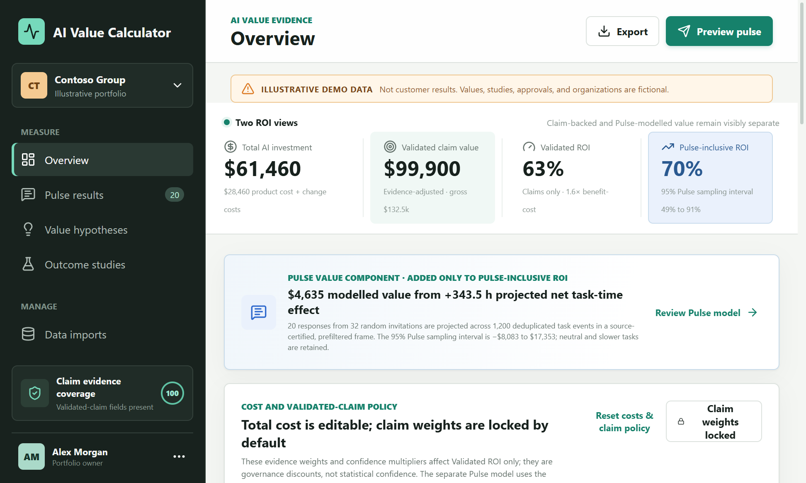
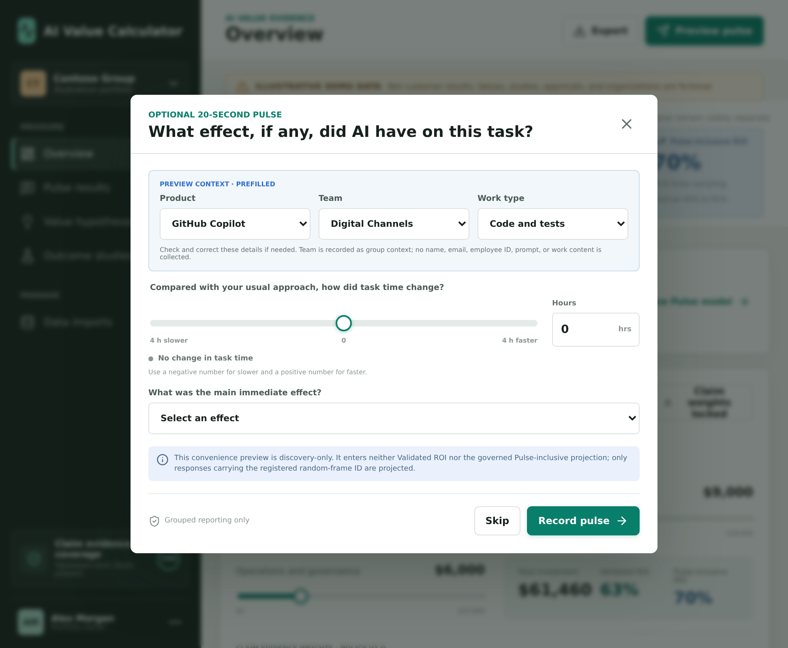
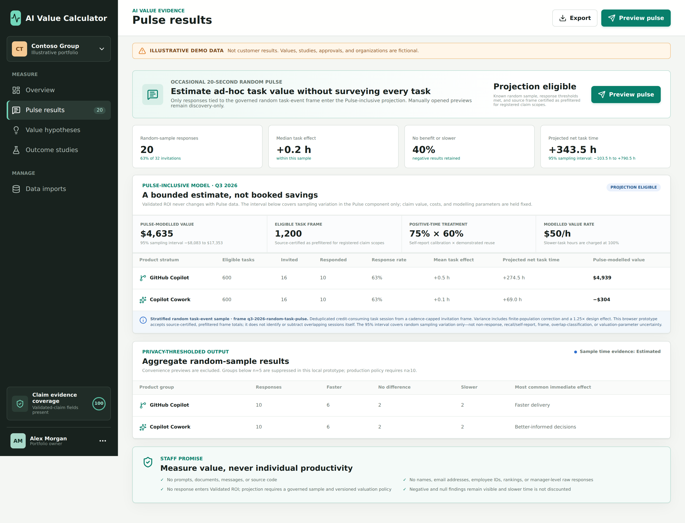
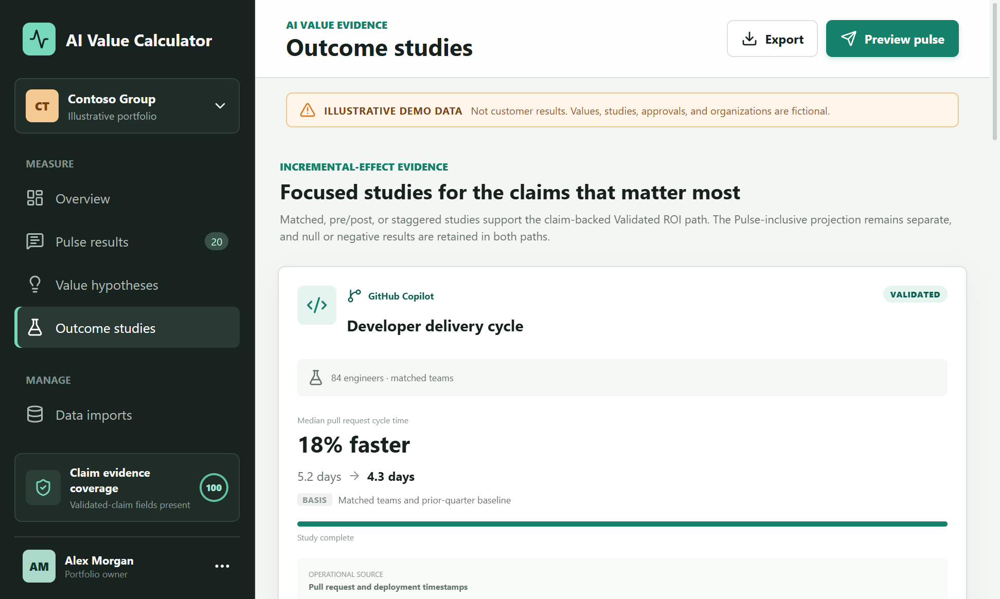

# AI Value Calculator

> **Illustrative prototype:** every organization, study, approval, cost, and result in this repository is fictional demo data. Nothing shown is a customer result.

AI Value Calculator helps leaders decide where to **scale, redesign, keep measuring, or stop** AI investment. It combines existing aggregate cost and workflow data with occasional neutral staff pulses and focused outcome studies. It never inspects work content or scores individuals.

The dashboard deliberately reports two decision views against the same total AI investment:

| View | Value included | Interpretation |
| --- | --- | --- |
| **Validated ROI** | Evidence-adjusted claims at the Validated or Realized stage. | The claim-backed baseline. It contains no Pulse extrapolation. |
| **Pulse-inclusive ROI** | Validated claim value plus a separately governed estimate for the unclaimed long tail of small, ad-hoc tasks. | A modelled portfolio estimate shown with a 95% **Pulse sampling interval** and explicit assumptions; it is not booked savings. |

No Pulse response enters Validated ROI. The interval on Pulse-inclusive ROI measures sampling variation in the Pulse component only; it does not represent every source of uncertainty in the portfolio.

## The Decisions the AI Value Calculator Supports

AI Value Calculator is designed to answer four questions without creating a parallel reporting job for employees:

1. What did the organization invest, including implementation and change costs?
2. Where are there credible signals that AI changed work?
3. Which operational outcomes are repeatable and plausibly attributable to AI?
4. Which outcomes became realized or finance-approved business value?

Every claim ends in an explicit decision:

- **Scale** when the outcome is valuable, repeatable, and safe.
- **Redesign** when there is a promising signal but weak realization, quality, or adoption.
- **Continue measuring** when the study is underpowered or incomplete.
- **Stop** when value is absent, negative, or outweighed by total cost and risk.

Null and negative results remain visible.

## What Counts as Proof

AI Value Calculator keeps four value stages separate:

| Stage | Meaning | Financial treatment |
| --- | --- | --- |
| **Signal** | Usage, interviews, or an early operational pattern identifies a claim worth testing. | Excluded from Validated ROI; used to prioritize deeper study. |
| **Capacity** | Staff or process sampling estimates time released or added effort. | Excluded from Validated ROI. A governed probability sample may inform the separate Pulse-inclusive estimate. |
| **Validated** | A stable operational outcome has a baseline, credible comparison, guardrail, transparent valuation, and approval. | Eligible for evidence-adjusted Validated ROI. |
| **Realized** | Finance records show a posted saving, incremental gross margin, or another reconciled result. | Eligible for evidence-adjusted Validated ROI. |

"Validated" means claim-backed, not necessarily cash-only: a claim can have an observed operational outcome and a clearly identified, finance-approved modelled valuation. Realized claims identify the subset reconciled to posted financial or equivalent records.

In the calculator, a claim enters Validated ROI only when it is Validated or Realized, has positive gross value and valuation evidence, and has a unique overlap key for its cohort, benefit mechanism, and period. Signal and Capacity claims remain visible but do not enter that calculation.

**Discovery-only evidence** means an early Signal-stage finding or a manually opened Pulse preview that is useful for choosing what to study but is ineligible for both ROI calculations. A governed random-sample Pulse response is also excluded from Validated ROI, but it may enter the separate Pulse-inclusive projection when every projection gate passes.

Product usage alone never proves value. Reported time saved never becomes cash automatically. AI Value Calculator must be able to say **“no financial value proven yet”** and **“the model is not estimable.”**

## How It Works Without Disrupting Staff

### 1. Reuse existing aggregate data

AI Value Calculator starts with cost, usage, delivery, CRM, case-management, incident, and finance records. The import prototype accepts grouped CSV rows and rejects obvious direct-identifier columns such as names, email addresses, UPNs, and employee IDs.

### 2. Register a small number of hypotheses

Leaders define a use case, expected work effect, observable operational outcome, existing evidence source, and quality, risk, or workload guardrail. Staff do not log every AI-assisted task.

### 3. Use an occasional neutral pulse for discovery and bounded estimation

#### What the pulse asks

The optional pulse asks only:

- Compared with the usual approach, how many hours slower or faster was the task, using a synchronized slider or hours field?
- What was the main immediate effect, including no change or more rework?

Product, team, and work context are prefilled and can be corrected before submission. The pulse does not ask employees to infer business results they cannot observe. Responses are aggregated and negative answers are retained.

#### How responses become eligible for projection

Population projection is permitted only for invitations selected randomly from a known aggregate task-event frame. The demo strata are product groups. The frame counts deduplicated credit-consuming sessions rather than credits themselves; counting credits would over-represent chatty tasks in $N_h$ and inflate the projection. The fictional totals are certified as having been prefiltered upstream to remove sessions represented by registered value claims; the browser prototype checks that policy flag but does not identify or subtract overlapping sessions itself. Manually opened previews and other convenience responses remain discovery-only.

The prototype therefore distinguishes two response categories:

- **Governed random-sample response:** carries the registered sampling-frame ID and is eligible for projection if all count, response-rate, privacy, and anti-overlap gates pass.
- **Convenience preview:** opened manually to demonstrate or test the question. It can be stored as discovery evidence but is excluded from the random-sample aggregates and both ROI calculations.

### 4. Test the few claims that matter

Focused studies use matched groups, stable pre/post measures, staggered rollout, or stronger designs where practical. Operational systems provide the outcome; finance or risk owners approve the valuation mechanism. The result is a scale, redesign, continue, or stop decision.

## Staff Promise

AI Value Calculator is intended to measure investments and processes, not people.

- No prompt, document, message, meeting, or source-code inspection.
- No names, email addresses, UPNs, employee IDs, or individual productivity scores.
- No employee ranking or individual performance-management use.
- No raw employee responses for line managers.
- Minimum group-size suppression for reporting.
- No individual response enters Validated ROI, and no convenience response enters the Pulse-inclusive projection.
- A published purpose, access policy, retention period, cadence cap, snooze, and opt-out in production.
- Findings, including null and negative results, shared back with participating groups.
- Employee representatives and privacy teams involved before production rollout.

The local prototype enforces aggregate Pulse display at **n≥5** to demonstrate privacy suppression. Projection eligibility is a separate statistical gate and currently requires **at least 10 responses in every stratum** plus a **50% response rate**. Production thresholds must be approved and enforced server-side; meeting a minimum count does not by itself establish representativeness.

## Worked Demo Claim

The developer-delivery example shows the complete chain. All figures are illustrative.

| Claim field | Demo value |
| --- | --- |
| AI use case | GitHub Copilot for code and tests |
| Cohort and period | 84 engineers, Q2 2026 |
| Operational outcome | Median pull-request cycle time changed from 5.2 to 4.3 days |
| Comparison | Matched teams and prior-quarter baseline |
| Guardrail | Escaped defects did not increase |
| Operational source | Pull-request and deployment timestamps |
| Gross valuation | 1,680 backlog hours used × $50 approved contribution per hour = $84,000 |
| Valuation source | Finance backlog valuation policy v1 |
| Evidence | Outcome: Observed; valuation: Modelled; confidence: High |
| Stage | Validated; eligible for evidence-adjusted Validated ROI |
| Overlap key | Digital Channels + delivery + Q2 2026 |

The overlap key prevents the same cohort, period, and benefit mechanism being counted again from another study. A production data pipeline must also remove sessions mapped to registered claim scopes before supplying Pulse frame totals. The demo represents that upstream control with a certification flag rather than implementing session-level matching in the browser.

## Valuation Method

### Five-link evidence chain

Every financial claim must connect:

1. **Investment:** licenses, consumption, implementation, enablement, support, and governance.
2. **Adoption:** aggregate product and workflow use.
3. **Work effect:** faster, slower, improved or reduced quality, broader scope, or changed control coverage.
4. **Operational outcome:** throughput, cycle time, spend, quality, revenue conversion, or risk changed against a baseline.
5. **Financial realization:** finance-approved value follows an explicit mechanism.

### Valuation rules by business-value pillar

| Pillar | Eligible valuation mechanism | Not sufficient |
| --- | --- | --- |
| **Improved Performance** | Capacity demonstrably used on committed demand, economically meaningful lead-time reduction, or measured incremental throughput. | Time saved without evidence of reuse. |
| **Cost Savings** | Reconciled or approved reductions in invoices, overtime, contractors, processing cost, or hiring plans. | Faster work with no reduced cost. |
| **Innovation / Transformation** | Incremental gross margin or approved value after customer adoption of a new capability or operating model. | A prototype, idea, interview, or attributed revenue without a counterfactual. |
| **Risk Mitigation** | Expected-loss reduction using stable incident probability, severity, and impact assumptions approved by risk owners. | More reviews or controls without an outcome measure. |

Each claim has one primary pillar. That avoids cross-pillar duplication, while overlap keys prevent duplicate counting across evidence sources.

### Evidence and valuation are graded separately

A claim can observe an operational result and model its financial value. AI Value Calculator records both grades:

- **Observed:** measured in an operational or financial system.
- **Estimated:** inferred from a representative sample. Only a governed probability sample qualifies for the Pulse projection.
- **Modelled:** calculated from explicit assumptions and observed or estimated inputs.
- **Anecdotal:** supported by a qualitative case or individual account.

The more conservative of the operational and valuation evidence weights applies, followed by the confidence multiplier:

$$
\mathrm{Adjusted\ claim\ value} =
\mathrm{Gross\ claim\ value} \times
\min(\mathrm{Operational\ weight},\mathrm{Valuation\ weight}) \times
\mathrm{Confidence\ multiplier}
$$

Evidence weights and High/Medium/Low confidence multipliers are governed claim-policy discounts, not statistical confidence levels or confidence intervals. The UI locks them by default and labels unlocking as scenario review. They affect Validated ROI only; production policy must be approved and versioned before results are viewed.

The Pulse path has two distinct evidence layers. Its sampled task-time effect is **Estimated** evidence because it comes from a probability sample, while converting those hours to money is **Modelled** using explicit calibration, reuse, and value-rate assumptions. The claim evidence sliders do not apply to the Pulse estimate; its uncertainty and conservatism are disclosed through the sampling interval and Pulse-specific policy instead.

### Two ROI views

#### Validated ROI

The first number is the existing claim-backed calculation. Only Validated and Realized claims enter it, and every contribution retains its operational grade, valuation grade, confidence multiplier, formula, approval, and overlap key:

$$
\mathrm{Validated\ ROI} =
\frac{\mathrm{Evidence\text{-}adjusted\ validated\ value} - \mathrm{Total\ AI\ investment}}
{\mathrm{Total\ AI\ investment}}
$$

It contains no Pulse extrapolation.

#### Pulse-inclusive ROI

The second number estimates the unclaimed long tail of ad-hoc work. For each stratum $h$, $N_h$ is the known number of eligible task events and $\bar y_h$ is mean self-reported net hours from randomly sampled responses, including zeros and negative values:

$$
\widehat H_{\mathrm{Pulse}} = \sum_h N_h\bar y_h
$$

Sampling variance uses the within-stratum sample variance $s_h^2$, a finite-population correction (which shrinks the variance when a large share of the population is sampled), and a disclosed design effect $D_h$ (which inflates the variance to account for clustering, stratification, or unequal weighting that is not present in a simple random sample):

$$
\operatorname{SE}(\widehat H_{\mathrm{Pulse}}) =
\sqrt{\sum_h N_h^2
\left(1-\frac{n_h}{N_h}\right)
\frac{s_h^2}{n_h}D_h}
$$

The prototype uses a conservative Student-$t$ critical value based on the smallest stratum degrees of freedom to show a 95% sampling interval. Response rates and every stratum are shown alongside it.

The interval covers random sampling variation only. It does **not** cover non-response bias, recall or self-report bias, task-frame coverage error, mistakes when excluding overlapping claim scopes, uncertainty in the calibration or reuse assumptions, or uncertainty already present in validated claims and costs.

Time is valued asymmetrically. Positive reported capacity is reduced by a calibration factor $c$ and a demonstrated-reuse rate $r$. Slower-task time is charged at the full policy-set hourly value rate $v$. The asymmetry is deliberate: reported time saved is fragile and receives calibration and reuse haircuts, while reported time lost is charged at full rate so the model cannot reward suppressing bad results.

$$
g(y_i)=v\begin{cases}
y_i c r, & y_i > 0\\
y_i, & y_i \le 0
\end{cases}
$$

$$
\widehat V_{\mathrm{Pulse}}=\sum_h N_h\overline{g(y)}_h
$$

$$
\mathrm{Pulse\text{-}inclusive\ ROI} =
\frac{\mathrm{Validated\ value}+\widehat V_{\mathrm{Pulse}}-\mathrm{Total\ AI\ investment}}
{\mathrm{Total\ AI\ investment}}
$$

The same transformation is used to calculate the monetary interval. The displayed Pulse-inclusive ROI interval adds the lower and upper Pulse value estimates to a fixed Validated value and fixed total cost; it is therefore not a full portfolio uncertainty interval. The estimate is enabled only when all of these gates pass:

- A known task-event population and random invitation mechanism exist.
- Every stratum meets minimum response-count and response-rate thresholds.
- Invitation counts are retained so non-response is visible.
- The source certifies that registered claim scopes were removed upstream before supplying frame totals. The prototype checks the certification flag; production requires auditable session-level enforcement.
- The self-report calibration, reuse rate, hourly contribution value, design effect, period, and methodology version are disclosed.
- Neutral and negative responses remain in the estimator; quality effects receive no financial value unless separately validated.

Exports preserve the two views in separate `roiViews.validated` and `roiViews.pulseInclusive` records, together with the Pulse policy and projection diagnostics. If the projection gates fail, the Pulse-inclusive financial fields are exported as `null` rather than silently falling back to Validated ROI.

The illustrative policy uses 75% self-report calibration, 60% capacity realization, $50 per reused contribution hour, a 1.25× design effect, at least 10 responses per stratum, and at least a 50% response rate. These are fictional demonstration assumptions, not recommended universal defaults.

### Total cost, ROI, and benefit-cost ratio

The prototype includes product spend, implementation, enablement, and ongoing operations or governance:

$$
\mathrm{Total\ AI\ investment} =
\mathrm{Product\ cost} +
\mathrm{Implementation} +
\mathrm{Enablement} +
\mathrm{Operations}
$$

Both views use the same ROI operator, with a different value numerator $V$:

$$
\mathrm{ROI}(V) =
\frac{V - \mathrm{Total\ AI\ investment}}
{\mathrm{Total\ AI\ investment}}
$$

$$
\mathrm{Benefit\text{-}cost\ ratio}(V) =
\frac{V}
{\mathrm{Total\ AI\ investment}}
$$

For Validated ROI, $V$ is evidence-adjusted Validated and Realized claim value. For Pulse-inclusive ROI, $V$ is that same claim value plus the eligible Pulse-modelled value. The investment denominator is not duplicated.

### Demo policy defaults

#### Cost and Validated-claim policy

| Input | Default | Purpose |
| --- | ---: | --- |
| Product spend | $28,460 | Illustrative Copilot product cost |
| Implementation | $18,000 | Integration and setup cost |
| Enablement and training | $9,000 | Responsible adoption and role-based enablement |
| Operations and governance | $6,000 | Support, measurement, privacy, and control cost |
| Observed evidence | 100% | No evidence-type discount |
| Estimated evidence | 70% | Representative estimation reserve |
| Modelled evidence | 75% | Assumption and calibration reserve |
| Anecdotal evidence | 0% | Contributes no value under the default Validated-claim policy |
| High / Medium / Low confidence | 100% / 85% / 50% | Design and source-quality reserve |

#### Pulse-inclusive projection policy

| Input | Default | Purpose |
| --- | ---: | --- |
| Sampling frame | 1,200 task events | Fictional deduplicated, credit-consuming sessions certified as prefiltered upstream for registered claim scopes |
| Invitations | 16 per product stratum | Known denominator for response-rate disclosure |
| Minimum responses | 10 per stratum | Projection eligibility gate |
| Minimum response rate | 50% per stratum | Non-response eligibility gate, not proof that non-response bias is absent |
| Self-report calibration | 75% | Reduces positive reported time for likely reporting error |
| Capacity realization | 60% | Values only the share of positive time assumed to be reused productively |
| Modelled value rate | $50 per hour | Fictional policy-set contribution value; not a universal labor-cost rate. Set independently of the backlog-hour rate used in the worked demo, which happens to coincide for illustration. |
| Design effect | 1.25× | Inflates sampling variance for residual design complexity |
| Pulse sampling confidence level | 95% | Sampling interval level; other uncertainty sources remain outside the interval |
| Negative task time | 100% of value rate | Retains the full modelled cost of slower work |

## Claim Auditability

Every claim contribution records:

- Owning group, cohort, period, and primary pillar.
- Baseline and comparison method.
- Operational source and effect.
- Quality, safety, or workload guardrail.
- Gross value formula and valuation source.
- Operational evidence, valuation evidence, and confidence rating.
- Stage, approval, and overlap key.
- Whether it is included in or excluded from Validated ROI.

The dashboard's **Claim evidence coverage** score reports whether required fields are present on Validated-ROI claims. It is a presence check, not a quality assessment: it does not grade the Pulse model, judge whether the recorded evidence is strong, or claim that a study is causally perfect. **Policy retention** separately reports how much eligible gross claim value remains after evidence and confidence weights.

## MVP Capabilities and Boundaries

| Capability | Prototype status |
| --- | --- |
| Explicit sample-data disclosure in every view and export | Implemented |
| Four evidence stages and Validated-ROI eligibility rules | Implemented |
| Separate operational and valuation evidence | Implemented |
| Validated ROI, Pulse-inclusive ROI, benefit-cost ratio, and total-cost inputs | Implemented |
| Claims register, formulas, approvals, guardrails, and overlap protection | Implemented with fictional seed data |
| Neutral optional pulse with negative and no-change responses | Implemented |
| Separate stratified Pulse estimate with 95% sampling interval | Implemented with a fictional governed sample frame |
| Convenience-response exclusion and projection gates | Implemented locally |
| Aggregate Pulse reporting threshold | Implemented locally at n≥5 |
| Automated removal of claim-overlapping sessions from the Pulse frame | Not implemented; the demo accepts source-certified, prefiltered totals |
| Direct-identifier checks for browser CSV imports | Implemented as basic field-name checks |
| Tenant authentication, RBAC, governed retention, and audit history | Not implemented |
| API connectors and production statistical engine | Not implemented |
| Server-side n≥10 suppression, non-response adjustment, and sensitivity analysis | Not implemented |

The prototype is a React and TypeScript single-page app. It stores demo responses, hypotheses, import metadata, and policy settings in `localStorage`. CSV content is parsed in the browser; imported rows are not persisted by the prototype.

Basic field-name checks are not a production data-loss-prevention control. Do not upload sensitive or real employee data.

### Limits of this prototype

A few limitations are called out in-line above; they are consolidated here so a reviewer can weigh them together:

- Upstream claim-scope exclusion is a **trust flag**, not enforcement. The browser checks that the source certifies prefiltering; it cannot verify session-level removal.
- The 95% Pulse sampling interval covers **sampling variation only**. Non-response bias, recall or self-report bias, task-frame coverage error, and uncertainty in the calibration, reuse, and hourly-value assumptions are outside the interval.
- CSV import runs **field-name checks**, not DLP. The prototype rejects obvious direct-identifier columns but does not inspect row content, and it does not persist imported rows.
- Policy weights, projection gates, and suppression thresholds are enforced **client-side** for demonstration. Production must enforce them server-side under authenticated, versioned policy.

## Screenshots

### Decision-grade portfolio overview



### Neutral employee pulse



| Governed Pulse projection | Outcome studies and evidence stages |
| --- | --- |
|  |  |

## Production Path

1. Agree the permitted purpose, staff promise, reporting threshold, cadence cap, retention, and opt-out with privacy teams and employee representatives.
2. Add Entra ID authentication, least-privilege roles, tenant isolation, audit history, and server-side suppression.
3. Add governed aggregate connectors for Microsoft, GitHub, delivery, CRM, case, incident, and finance systems.
4. Configure the task-event population, sessionization rules, auditable claim-scope removal, strata, random invitation probabilities, power target, non-response analysis, and uncertainty intervals before enabling projection.
5. Pre-register primary outcomes, guardrails, exclusions, comparison design, and success or stop thresholds.
6. Version finance and risk valuation policies independently of study results.
7. Add independent review and signed evidence packs for material investment decisions.

## Run Locally

Requirements: a current Node.js release and npm.

```bash
npm install
npm run dev
```

Open the URL printed by Vite, normally `http://localhost:5173`.

Validate the project with:

```bash
npm run build
npm run lint
npm run test
```

The unit suite exercises evidence eligibility, dual evidence weights, total cost, Validated ROI, overlap prevention, pillars, projection gating, upstream frame certification, stratified Pulse estimation, negative-task treatment, and the Pulse-inclusive ROI interval. Integration tests exercise the dual dashboard figures, locked claim weights, neutral Pulse collection, aggregate reporting, modelling disclosures, hypotheses and guardrails, the claims register, and identifier-aware CSV ingestion.

## Evaluation and Privacy References

The production design should be reviewed against the organization's own finance, workforce, privacy, and statistical policies. Useful public references include:

- [HM Treasury Green Book](https://www.gov.uk/government/publications/the-green-book-appraisal-and-evaluation-in-central-government) for appraisal and valuation principles.
- [HM Treasury Magenta Book](https://www.gov.uk/government/publications/the-magenta-book) for evaluation design and causal claims.
- [Guidance on the Impact Evaluation of AI Interventions](https://www.gov.uk/government/publications/the-magenta-book/guidance-on-the-impact-evaluation-of-ai-interventions-html) for AI-specific evaluation design.
- [NIST Privacy Framework](https://www.nist.gov/privacy-framework) for privacy risk management.
- [NIST AI Risk Management Framework](https://www.nist.gov/itl/ai-risk-management-framework) for AI risk and governance.