# AI Value Calculator

**Judge consumption-based AI by the value of the work, not the volume of usage.**

When tools such as GitHub Copilot and Copilot Cowork are billed by consumption, one monthly bill bundles together many people doing very different work. The bill tells you what AI cost. This MVP explores how to show what it was worth, by combining two approaches in one process:

- **Random, low-burden sampling** for the long tail. A few people are occasionally asked one 20-second question about a randomly chosen AI task, and the answers are extrapolated to all task sessions.
- **Pre-registered studies** for the big rocks. Managers nominate a few hypotheses, management prioritises them, and each is tested the AI way against the usual way before it can claim financial value.

The two approaches feed each other. Survey signals suggest hypotheses to test, and studies calibrate how far self-reported time savings can be trusted.

**Live demo:** [jasonumiker.github.io/ai-value-calculator](https://jasonumiker.github.io/ai-value-calculator/) · Background: [the blog post behind this project](https://medium.com/@jason-umiker/your-bill-tells-you-what-ai-costs-you-but-proving-what-its-actually-worth-is-a-real-challenge-a349b9c3643e)

> **Illustrative prototype:** every organisation, cost, response, study, approval, and decision is fictional demo data. The app runs entirely in your browser.

## Three personas, one process

Use **View as** in the sidebar to switch between the people the blog post describes. Each persona only answers the questions they're in a position to answer.

| Persona | What they do | Where |
| --- | --- | --- |
| **Employee** | Occasionally answers one question about a random AI task: how task time changed, the main effect, and optionally how saved time was used. They never convert minutes into dollars. | Pulse inbox |
| **Manager** | Turns team signals into a few sized, pre-registered hypotheses (up to five open at a time), runs the studies, and proposes valuations for supported results. | My team, Pulse signals, Hypotheses, Studies |
| **Finance & executive** | Sets the evidence and valuation rules, prioritises hypotheses, approves valuations, owns the bill, and decides where the next dollar goes. | Portfolio, Decisions, Approvals, Hypothesis priorities, Rules & policy, Sampling engine, Bills & usage data |

Every caveat lives in one **Assumptions & limits** panel, so the screens can tell the story without a disclaimer on every card.

## Employee: one question, occasionally

The inbox shows the next randomly selected task: *“On Wed 16 Sep you used Copilot Cowork for customer communication.”* The employee drags the time slider, picks the main effect, and optionally says what they did with any time saved. They can also skip. The side panel shows the live Pulse estimate their answer feeds, and how much it just moved.

Answers are stored against the task's product, team, and work type only. The pseudonymous person key needed to deliver invitations stays in the invitation service's routing table. It is never joined to answers and never exported.

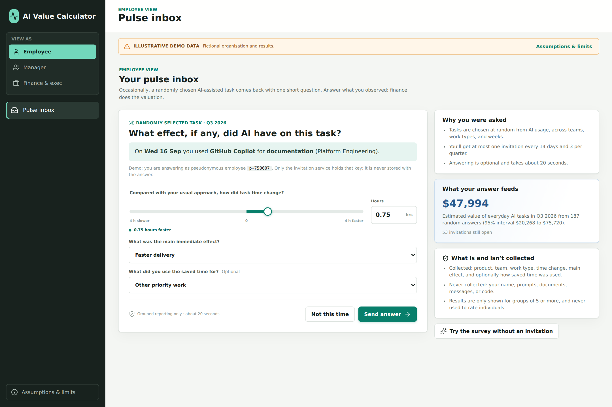

## Finance & executive: the portfolio for one quarter

Costs and value always cover the same quarter:

- **Total AI cost** = consumption spend from the imported bill + implementation, enablement, and operations costs for that quarter.
- **Validated ROI** counts only claims that finance approved for the quarter, discounted by the evidence policy.
- **Pulse-inclusive ROI** adds the long-tail estimate, with a 95% sampling interval.

In the Q3 2026 demo, total cost is $45,838 and validated value is $66,480 (45% ROI). The Pulse estimates a further $47,994 (95% interval $20,268 to $75,720), for a Pulse-inclusive ROI of 150%. The trend shows Q2 at −39% validated ROI, a heavy-implementation quarter before the studies reported.

**Unit economics** asks the consumption-pricing question directly: for each product and work type, is the modelled value of a sampled session worth its cost per session? In the demo, customer communication, document drafting, and documentation are *Worth it*. Data analysis, where people report rework, and debugging, where a study found self-reports can't be trusted, are *Not worth it* under current practice. The rest are still *Uncertain* at this sample size.

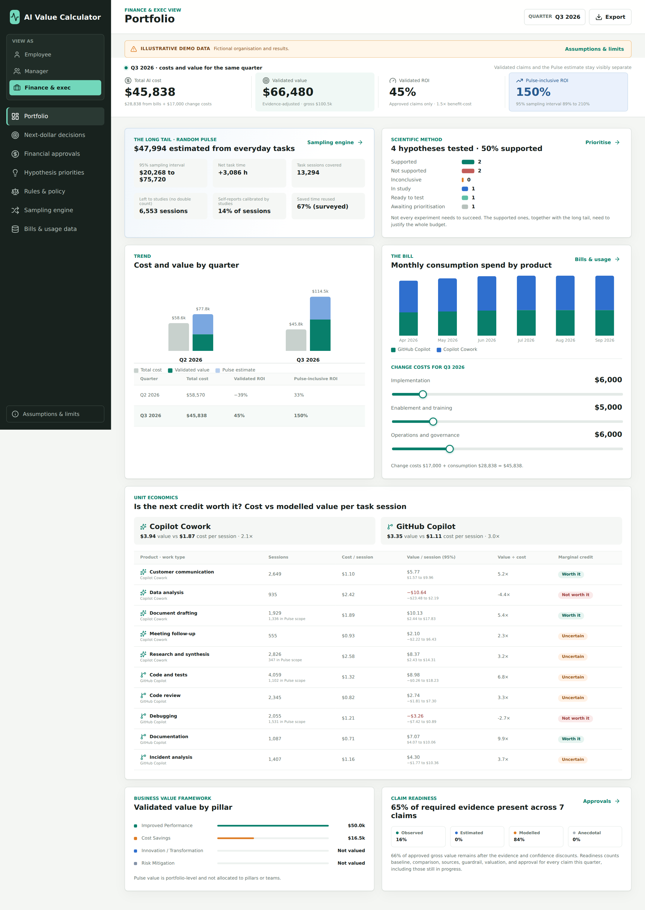

### Next-dollar decisions

For each team, the policy suggests **Scale**, **Redesign**, **Keep measuring**, or **Stop** from the evidence on screen, applying these rules in order:

1. A guardrail breach means redesign.
2. Validated value at or above the policy's benefit ÷ cost threshold means scale.
3. Evidence still maturing means keep measuring.
4. A proven effect that doesn't pay back means redesign.
5. Nothing supported means stop.

Executives record the actual decision and their reasoning; overriding the suggestion is allowed and logged. Shared platform and change costs are allocated by each team's share of direct consumption spend.

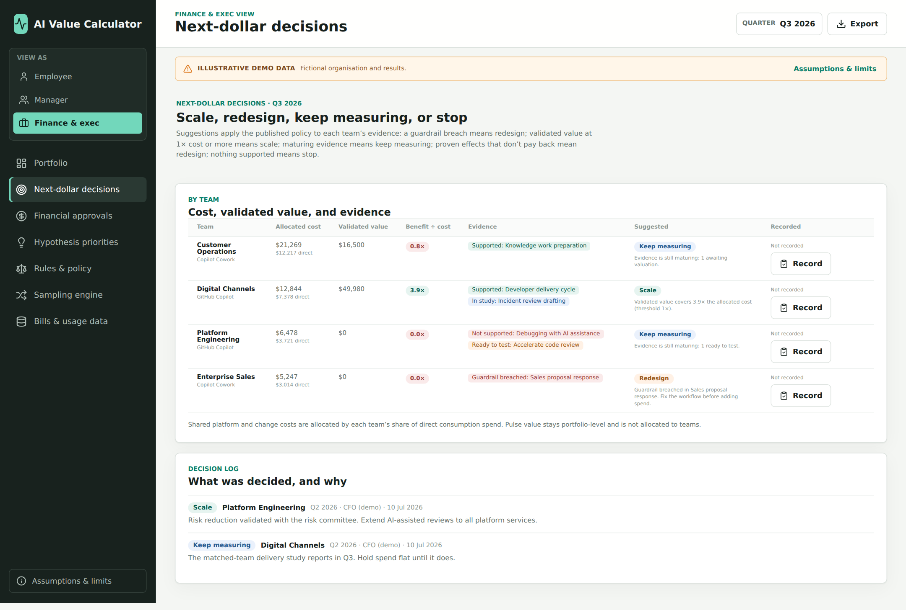

### Rules & policy

Finance owns a versioned policy:

- evidence weights (Observed ≥ Estimated ≥ Modelled ≥ Anecdotal) and confidence multipliers;
- the strongest evidence and confidence each study design can claim (randomised > matched groups > staggered rollout > before/after > anecdote);
- Pulse valuation: the contribution rate, default calibration and reuse, reuse weights, and whether slower tasks are charged at the full rate;
- sampling rules and the decision threshold.

Edit a draft, preview its effect on the quarter, then publish a new version with a reason. Every valuation records the policy version it was prepared under.

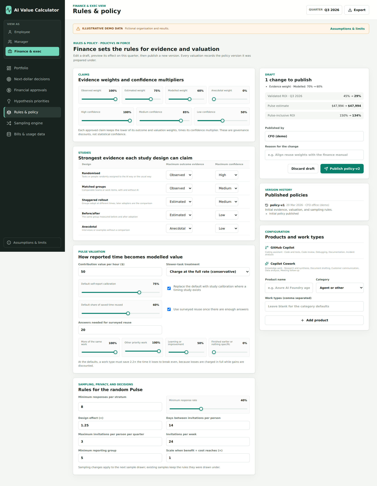

### Sampling engine

The sample is stratified by product and work type and spread over the weeks in proportion to each week's sessions. Nobody is invited within 14 days of an earlier invitation, including one from the previous quarter, or more than three times a quarter. The page shows:

- response and non-response by stratum;
- the weekly spread of invitations and answers;
- work left to registered studies so nothing is counted twice;
- a **measurement burden** meter. In Q3, answering took 1.3 hours in total, against an estimated 3,086 hours of net task time.

Import a new quarter's bill and you can draw its sample here. A sample drawn from part of a quarter covers only those months: when later months arrive, the Pulse estimate is withheld until you **Extend sample** to them at the same sampling rate.

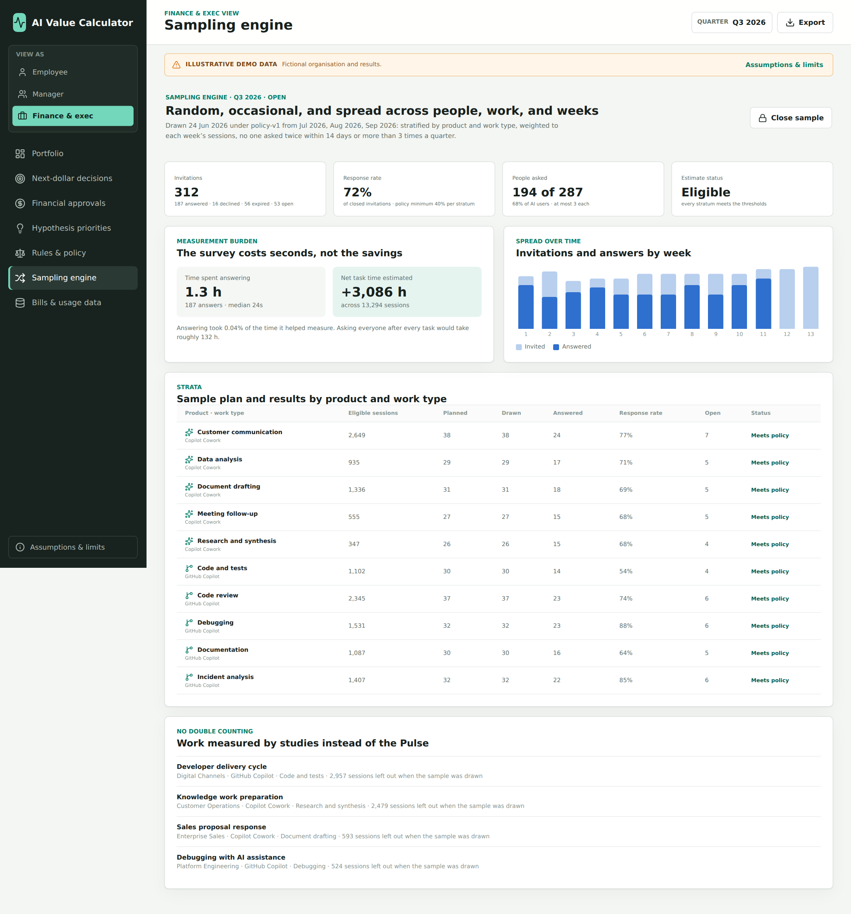

### Financial approvals

Valuation is simplified to **proposed → approved → realized**:

- Only a study with a *Supported* verdict can be valued.
- Claim confidence can't exceed the policy cap for the study's design.
- Changing the evidence after approval voids the approval.
- Realization reconciles the approved amount to the ledger; it replaces the value rather than adding a second benefit.

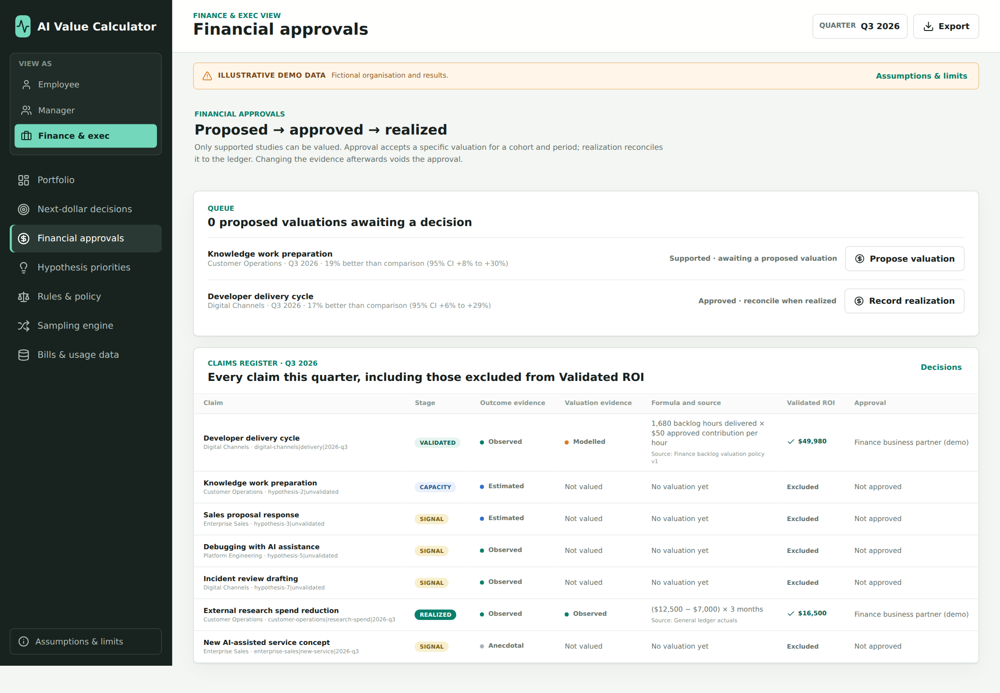

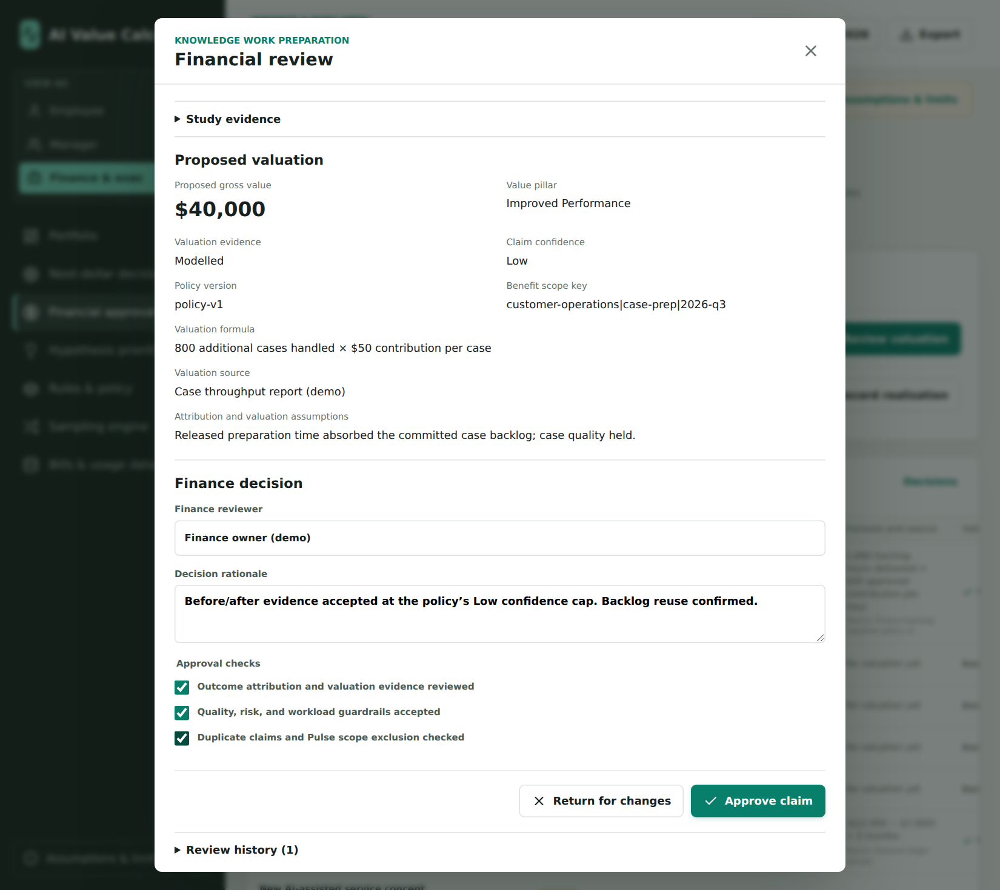

### Bills & usage data

Import grouped CSV exports with `period` (YYYY-MM or YYYY-Qn), `product`, `team`, and `cost`, plus optional `active_users`, `task_sessions`, and `credits`. Each file:

- replaces the rows it covers;
- sums sub-group rows to team level;
- registers new products;
- drives cost, the team split, unit economics, and the sampling population.

Files with user, email, name, UPN, or employee ID columns are rejected.

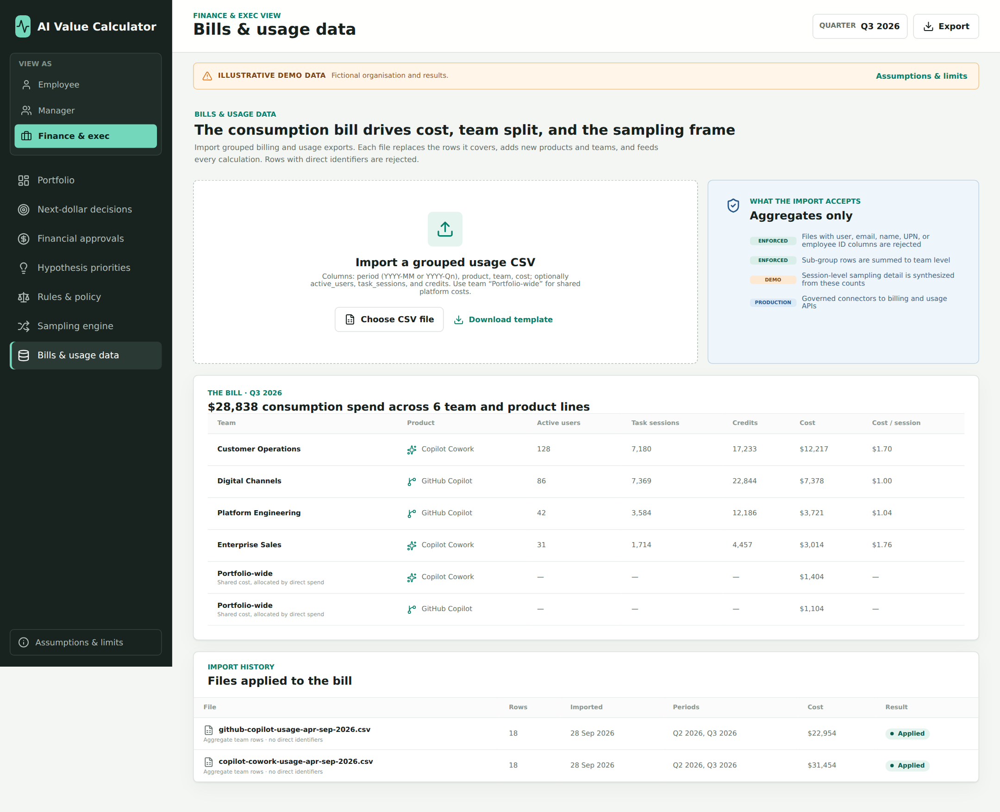

## Manager: from signals to tested hypotheses

**My team** shows the team's allocated cost, validated value, suggested decision, and signals by work type. Groups under five answers are hidden, and work covered by a study is marked as measured by that study.

**Pulse signals** shows portfolio-level results by product and work type. It also covers:

- **Calibration.** In the demo, a timing study found case preparation saved 18 minutes where people reported about 25, so self-reports for that work count at 72%. A randomised debugging trial found tasks were slower with AI while people reported saving time, so those self-reports count at 0%. This mirrors [METR's 2025 trial](https://metr.org/blog/2025-07-10-early-2025-ai-experienced-os-dev-study/), where experienced developers were 19% slower with AI while believing they were 20% faster.
- **Where saved time went.** The surveyed reuse rate replaces the default assumption once there are enough answers.

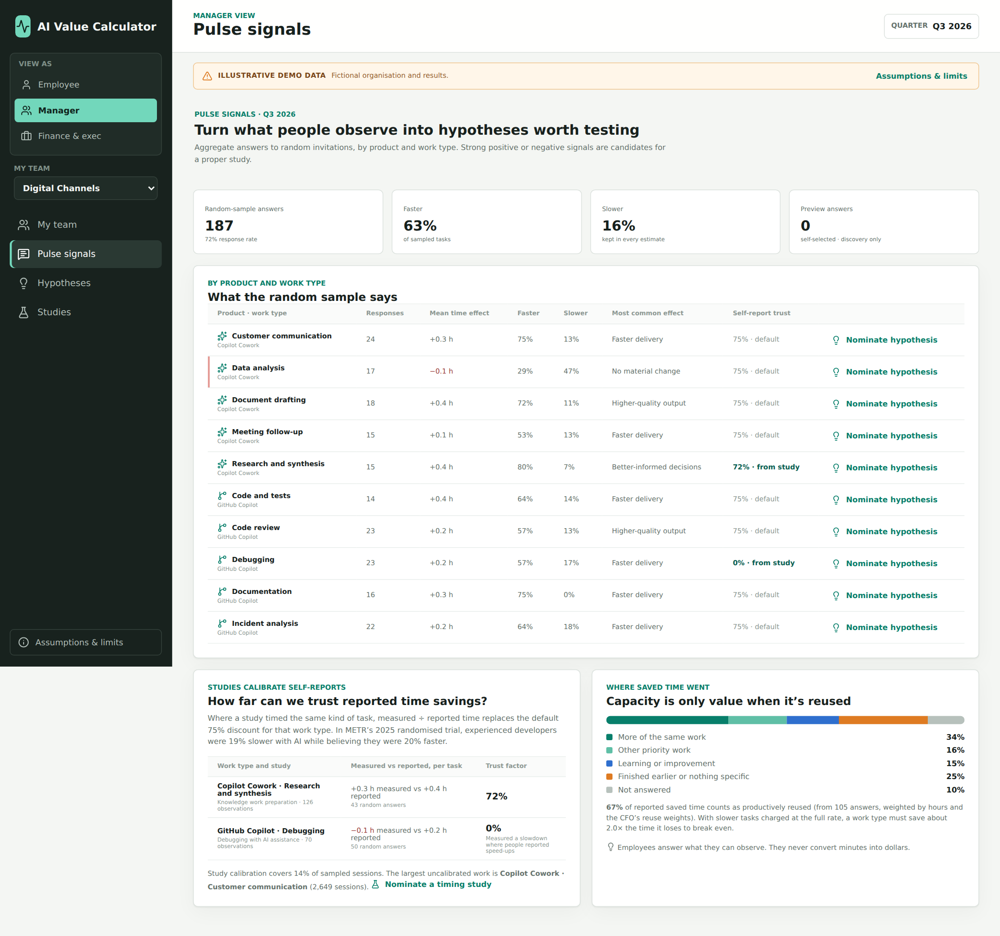

**Nominate hypothesis** on any signal prefills the use case, product, work type, and sizing from the usage log: how often it happens and for how many people. The manager adds the evidence source and guardrail and pre-registers the success criterion: metric, minimum improvement, guardrail limit, and minimum sample per group. The form shows the quarterly *value if true* at the CFO's rates.

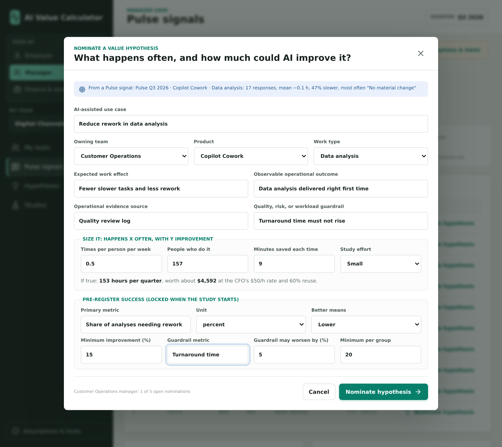

Management ranks hypotheses by value if true ÷ study effort and approves which to test. Status runs from *Awaiting prioritisation* to *Ready to test*, *In study*, and then a verdict. The **hit rate** shows how many tests were supported; not every experiment needs to succeed.

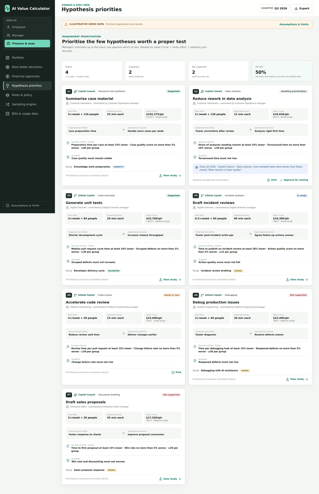

### Studies: the AI way against the usual way

When a study starts, the pre-registered criterion is copied and locked. The manager records the design and summary statistics for each group (n, mean, standard deviation) plus the guardrail change. The app computes the improvement with a Welch 95% interval and gives a verdict:

| Verdict | Rule |
| --- | --- |
| **Supported** | The whole interval shows improvement and the estimate meets the pre-registered threshold. |
| **Not supported** | The guardrail was breached, or the interval rules out the threshold. |
| **Inconclusive** | Too few observations for the registered minimum, or the interval is too wide to decide. |

The evidence grade comes from the policy's cap for the design, not from the study owner.

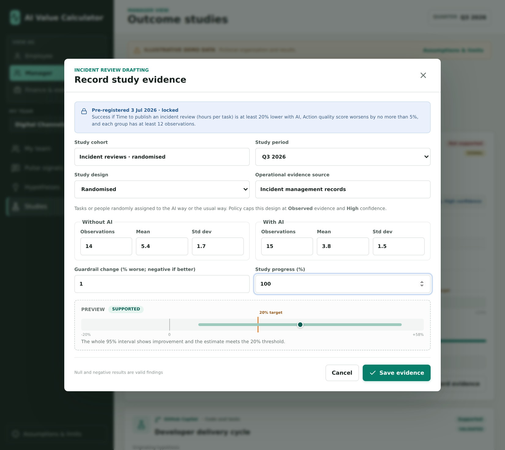

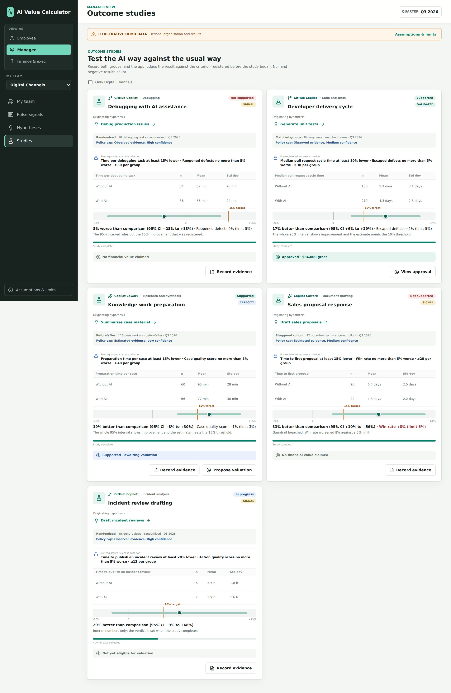

## How the numbers work

- **Validated value** = gross approved value × the lower of the outcome and valuation evidence weights × the confidence multiplier. A benefit scope key counts each benefit once.
- **Pulse estimate** = Σ over strata of eligible sessions × mean modelled value per sampled session. Invitations are spread in proportion to each week's sessions, so sessions within a stratum have a similar chance of selection. Modelled value is reported hours × calibration × share of time reused × the contribution rate. By default, slower tasks are charged in full, so a work type must save about 2.2× the time it loses to break even. The interval uses stratified variance with a finite-population correction and design effect. Projection is withheld until every stratum meets the minimum responses and response rate.
- **No double counting.** Work under a registered study when the sample is drawn is left to that study. Claims approved later are removed from the Pulse population and sample, using per-team session counts recorded when the sample was drawn.
- **Claim readiness** checks every claim for the quarter, including those still in progress, for a baseline, comparison, sources, guardrail, valuation, and approval.

Time saved is capacity, not automatically cash. The four pillars of Microsoft's Business Value framework each need a mechanism:

| Pillar | A defensible value mechanism |
| --- | --- |
| **Improved Performance** | Released capacity used on committed demand, higher useful throughput, or economically meaningful earlier delivery. |
| **Cost Savings** | Reduced invoices, contractor spend, overtime, or another approved and evidenced cost reduction. |
| **Innovation / Transformation** | Incremental gross margin or approved value from a new capability after adoption, not just a prototype. |
| **Risk Mitigation** | Reduced expected loss using explicit probability, severity, and impact assumptions approved by risk owners. |

## Try it locally

Requires a current Node.js release and npm.

```bash
npm install
npm run dev
```

Open the URL printed by Vite, normally `http://localhost:5173`.

Checks: `npm run lint`, `npm test`, `npm run build`.

To regenerate the screenshots in [docs/screenshots](docs/screenshots) from a clean demo state:

```bash
npx playwright install chromium
npm run screenshots
```

On Linux, Chromium also needs system libraries from `npx playwright install-deps chromium`, which may require administrator privileges.

## Project structure

| Path | Contents |
| --- | --- |
| [src/domain](src/domain) | Pure logic and its tests: policy, bill import and team split, session synthesis and stratified sampling, Pulse estimation and calibration, hypotheses, studies and verdicts, financial approval, portfolio, decisions, and the deterministic demo seed. |
| [src/state](src/state) | Persisted app data, actions, derived period views, and the export snapshot. |
| [src/pages](src/pages) | One component per page, grouped by persona. |
| [src/components](src/components) | Shared forms, cards, charts, and modals. |

## Deployment

[.github/workflows/ci.yml](.github/workflows/ci.yml) lints, tests, and builds every push and pull request, and deploys `main` to GitHub Pages. To enable it once, set **Settings → Pages → Build and deployment → Source** to **GitHub Actions**. The Vite base is relative, so the same build works locally and under the Pages project path.

## Prototype boundaries

This is a browser-only demo that stores changes in `localStorage`. Session-level usage is synthesized from the aggregate counts in the bill. Reviewer identities are self-declared, with no authentication, role-based access, or tamper-proof audit trail. Production use would need governed connectors to billing and usage data, a real invitation service, authentication and roles, retention and audit policies, and agreement with privacy teams and employee representatives. The in-app **Assumptions & limits** panel lists the statistical and valuation caveats. **Do not enter real employee or customer data.**
