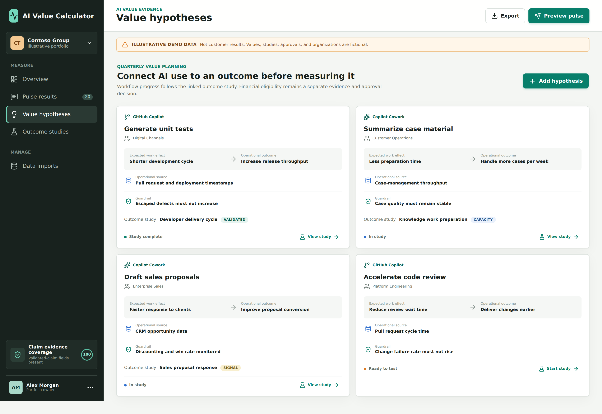
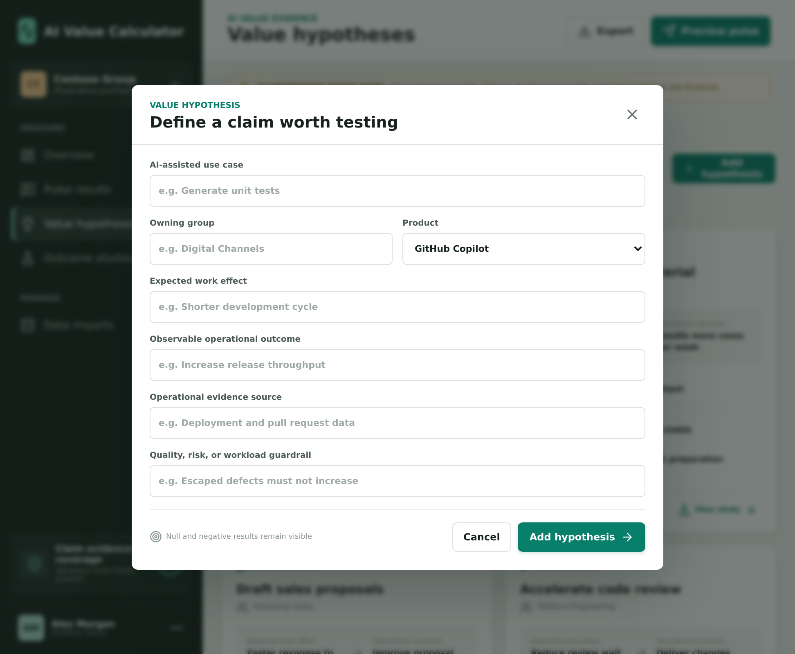
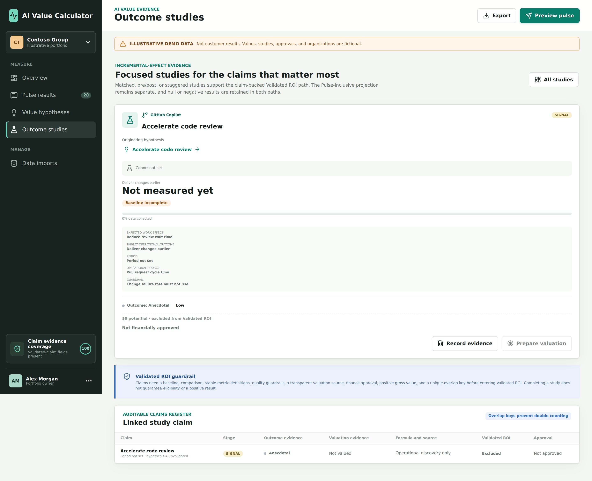
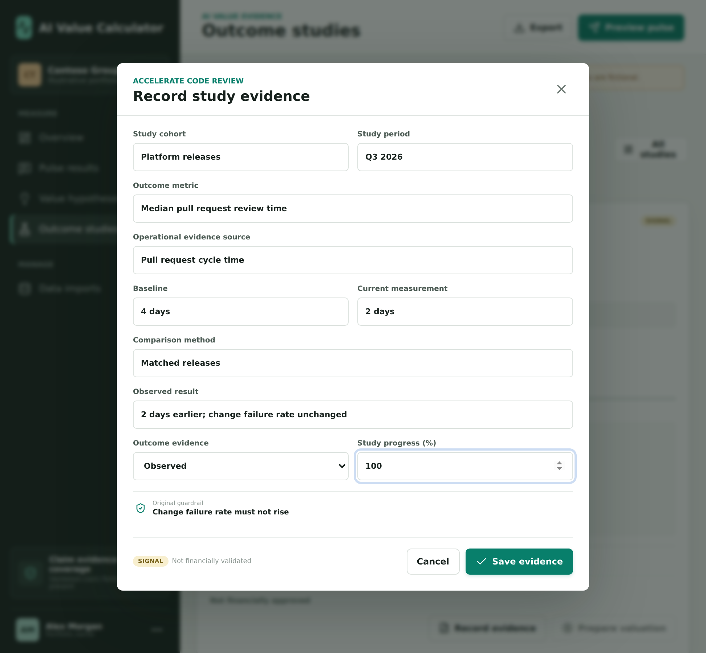
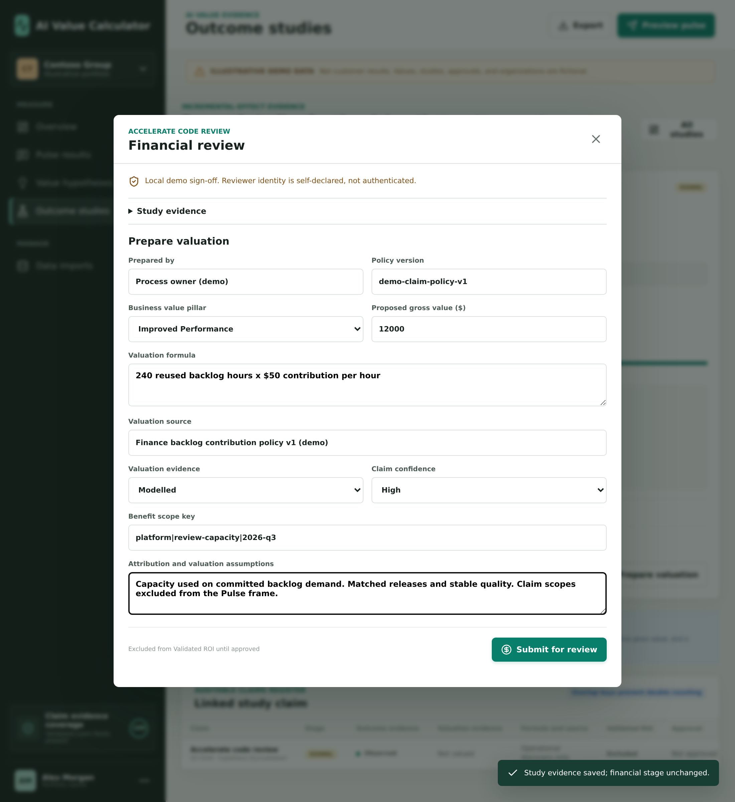
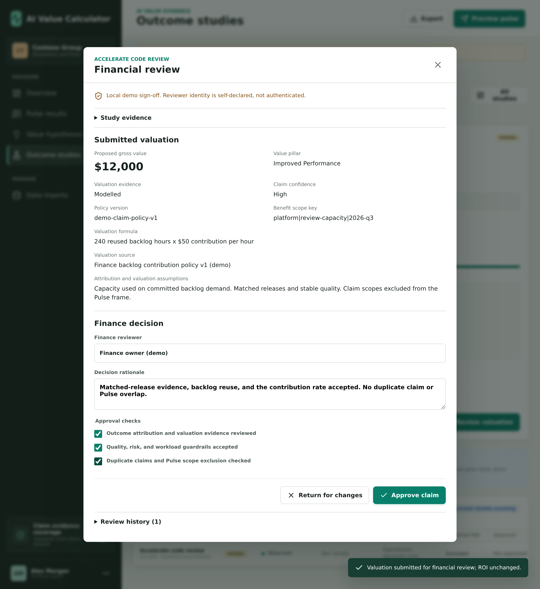
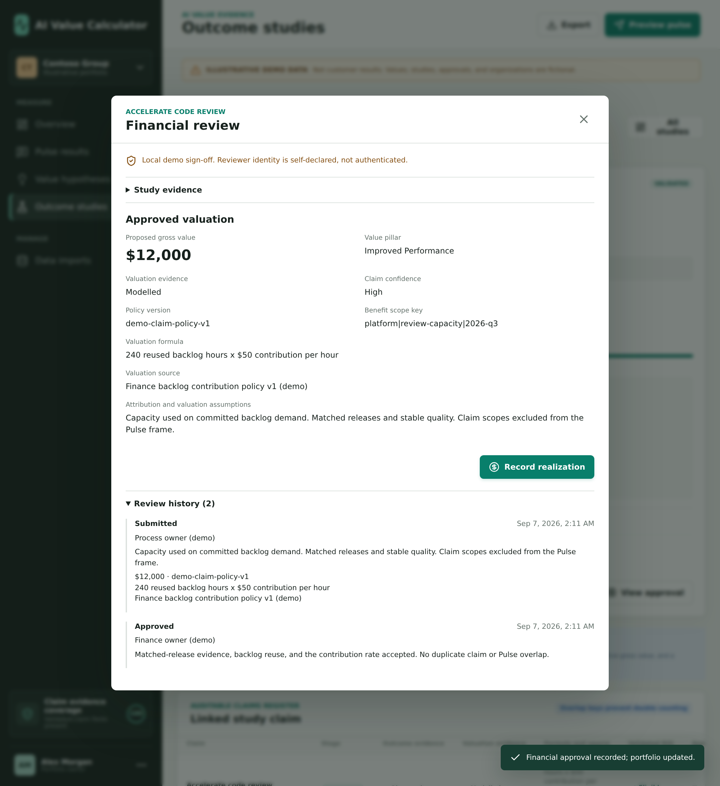
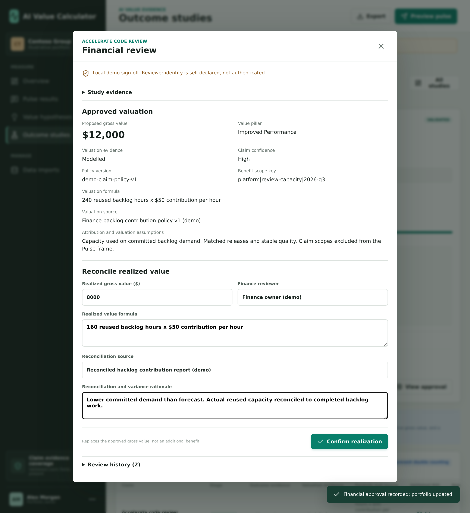
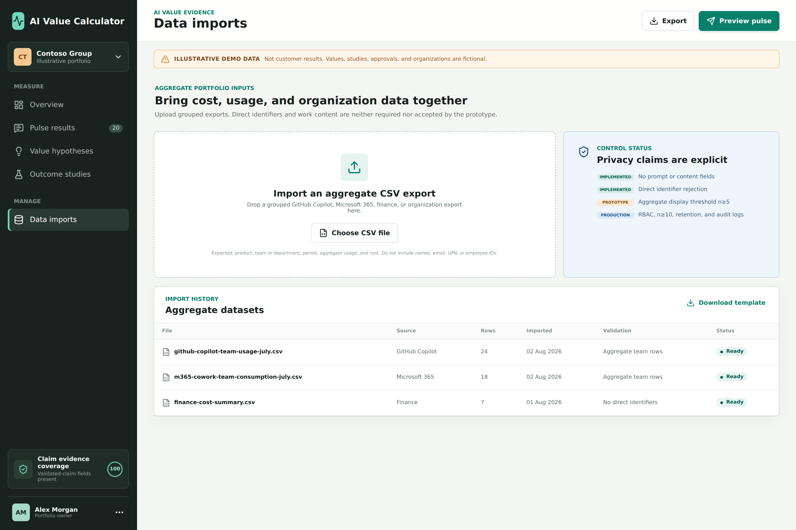

# AI Value Calculator

**Judge AI consumption by the value of the work, not the volume of usage.**

For tools such as GitHub Copilot and Copilot Cowork, consumption-based bills bundle together many people doing very different tasks. Tokens and credits tell you what was consumed, not whether it was worth funding. Higher spend can be a good investment; lower spend can still be waste.

AI Value Calculator combines **focused outcome studies** with **lightweight task sampling** to help leaders decide where to **scale, redesign, keep measuring, or stop**. The goal is to justify the portfolio and direct the next dollar, not manufacture a positive ROI for every AI interaction.

> **Illustrative prototype:** all organizations, costs, studies, approvals, and results are fictional demo data, not customer evidence.

## Why Both Studies and Sampling?

| Approach | Best suited to | Why it matters |
| --- | --- | --- |
| **Focused outcome studies** | Material, repeatable workflows: delivery, case handling, sales, or incident prevention. | Test a specific hypothesis against a baseline and credible comparison, with quality and risk guardrails. |
| **Random task sampling (Pulse)** | The long tail of small, ad-hoc tasks that rarely justify individual studies. | Estimate their aggregate effect without asking everyone to record every AI-assisted task. |

Studies alone can miss distributed value. Surveys alone cannot establish that AI caused a business outcome. Together, they give broad coverage with stronger scrutiny where the investment warrants it. Pulse feedback also helps identify the next hypotheses to test.

Employees answer occasional, optional questions about what they can observe: time gained or lost and the immediate work effect. Managers nominate and test a few meaningful hypotheses using existing operational records. Finance and executives set evidence and valuation rules, then decide where funding goes. Employees are not asked to invent an enterprise ROI.

## App Tour

The screens support one measurement cycle: bring together aggregate data, gather task-level signals, test material claims, review their financial value, and revisit investment decisions. Hypothesis-to-study handoff, evidence entry, financial approval, and realization work locally. The prototype does not run experiments, authenticate reviewers, or independently certify findings.

### 1. Overview: Decide Where the Next Dollar Goes

The opening dashboard brings together total AI investment, evidence-adjusted claim value, and two deliberately separate ROI views:

| View | What it includes |
| --- | --- |
| **Validated ROI** | Evidence-adjusted Validated and Realized claims with a recorded financial approval matching their evidence and valuation. No Pulse extrapolation; Signal, Capacity, pending, and returned claims are excluded. |
| **Pulse-inclusive ROI** | The same claim-backed value plus a separately labelled estimate for unclaimed tasks. A broader portfolio view, not booked savings. |

**Why two numbers?** A single blended ROI would hide how much of the business case rests on validated claims and how much depends on extrapolation. The two views let a budget owner ask whether the claim-backed value justifies the investment, and how much the estimated long tail changes that assessment. Both use the same total-cost denominator.

The rest of the dashboard makes the headline figures inspectable:

- **Cost controls** include implementation, enablement, and operations or governance alongside product spend. These costs matter even when the consumption bill is easy to measure.
- **Evidence policy** discounts weaker claims instead of treating every benefit as equally reliable. Each claim uses the lower of its operational and valuation evidence weights, followed by a confidence multiplier. Claim weights are locked by default to distinguish policy from scenario exploration; they are not statistical confidence levels.
- **Value pillars and group comparisons** show which business mechanisms and processes support the investment. Pulse estimates remain portfolio-level rather than being allocated to teams or used to rank employees.
- **Claim evidence coverage** identifies missing documentation. It checks whether fields are present, not whether a study proves causality.

The **Export** action preserves both ROI views, assumptions, claim contributions, and Pulse diagnostics in a JSON snapshot. It includes linked hypotheses and studies, submitted valuation/evidence snapshots, reviewer decisions, timestamps, policy references, and realization records. This keeps the basis of the result available for review rather than reducing the discussion to a dashboard percentage.


### 2. Employee Pulse: Ask Only What People Can Observe

The short, optional Pulse asks how much faster or slower a task was than the usual approach and what immediate effect AI had. Product, team, and work context are prefilled and can be corrected. A synchronized slider and hours field support both quick answers and more precise estimates.

**Why this design?** Recording every interaction would consume some of the time AI is meant to release. Asking employees to calculate business value would also push them beyond what they can observe. An occasional, neutral question captures useful evidence without turning measurement into another reporting job.

The default time effect is zero, and the options include no change, slower work, and more rework. Names, prompts, documents, and source code are not requested. Quality and scope signals help identify worthwhile studies; they do not automatically receive a financial value.

The app's **Preview pulse** is a convenience response, not a random invitation. Submitting it records discovery evidence but changes neither ROI calculation. Production sampling requires a governed invitation process, not just a survey link.


### 3. Pulse Results: Estimate the Long Tail Transparently

Pulse results shows the sample size, invitation and response counts, faster and slower task effects, and a modelled value projection by product group. Its purpose is to make the assumptions behind the broader ROI view visible.

**Why sample tasks rather than credits?** A task that consumes many credits is not necessarily many valuable tasks. Projection therefore uses a known population of deduplicated task sessions, with random invitations within product groups. Sessions covered by registered claims must be removed upstream so their benefits are not counted again.

The financial estimate is deliberately cautious:

- Positive reported time is reduced for self-report error and the share assumed to be reused productively, then valued at an explicit contribution rate.
- Slower-task time is charged at the full policy rate. Zero and negative responses remain in the calculation.
- Projection is withheld when eligibility checks fail. The demo requires at least 10 responses and a 50% response rate in every product group; these are illustrative policy settings, not universal guarantees of representativeness.

The **95% Pulse sampling interval covers sampling variation only**. It does not cover non-response or self-report bias, population coverage errors, overlap-classification mistakes, or uncertainty in valuation assumptions, validated claims, and costs. A projected benefit is an estimate to test and govern, not money already saved.


### 4. Value Hypotheses: Agree What Success Would Look Like

The hypotheses page connects an AI-assisted use case to an expected work effect, an observable operational outcome, an existing evidence source, and a quality, risk, or workload guardrail. Managers can nominate a small set of meaningful claims instead of trying to study everything.

**Why separate hypotheses from results?** "People use Copilot" is an adoption statement, not an investment thesis. "Using Copilot to generate tests will shorten development cycles and increase release throughput without increasing escaped defects" is a claim that can be tested and disproved.

The register makes those expectations visible before interpreting results. **Start study** creates a linked study that inherits the use case, owning group, product, expected effect, target outcome, evidence source, and guardrail. Once linked, the action becomes **View study**, which opens the same record instead of creating a duplicate. The three existing example studies are linked to their originating hypotheses too.

Workflow status is derived from the linked study: **Ready to test** before a study exists, **In study** below 100% progress, and **Study complete** at 100%. The study's financial evidence stage is shown separately. Completing the workflow does not automatically add value to ROI.



The **Add hypothesis** form asks for the outcome and guardrail alongside the use case. That encourages measurement of useful business change rather than a convenient activity metric chosen after the fact.



### 5. Outcome Studies: Turn Promising Signals Into Defensible Claims

Outcome studies presents the evidence for material, repeatable workflows: cohorts, baselines, comparisons, operational sources, results, and guardrails. The examples illustrate matched-team, pre/post, and staggered-rollout approaches. The study design still needs human scrutiny; a before-and-after change alone is not proof that AI caused it.

**Why keep evidence stages separate?** Faster work, a validated business outcome, and a reconciled financial result are different achievements:

| Stage | Meaning | Treatment |
| --- | --- | --- |
| **Signal** | An early observation suggests something worth testing. | Excluded from Validated ROI. |
| **Capacity** | Time or effort changed, but its business value is not yet established. | Excluded from Validated ROI. |
| **Validated** | An outcome is supported by a comparison, guardrails, and an approved valuation mechanism. | Eligible for evidence-adjusted Validated ROI. |
| **Realized** | Value is reconciled to financial or equivalent records. | Eligible for evidence-adjusted Validated ROI. |

The claims register below the studies shows formulas, valuation sources, approvals, evidence grades, and inclusion or exclusion from Validated ROI. Operational evidence and valuation evidence are graded separately: an observed outcome may still have a modelled financial value. Overlap keys prevent duplicate claims for the same cohort, benefit mechanism, and period.

**Worked example:** the fictional developer study reports pull-request cycle time falling from 5.2 to 4.3 days, with matched teams and no increase in escaped defects. Its valuation is based on 1,680 backlog hours actually used at an approved $50 contribution per hour, giving $84,000 gross value. The demo's evidence policy reduces that to $63,000 of validated claim value. It is not a claim that an 18% faster cycle reduced payroll by 18%.


#### Follow a Hypothesis Into a Study

1. Choose **Start study** on an unlinked hypothesis. The app opens the new study and its claim-register entry. It starts at **Signal**, with no measured result, 0% progress, and zero financial value.
2. Use **Record evidence** to enter the cohort, period, metric, baseline, comparison, observed result, evidence grade, and progress. Completing a study requires a baseline, comparison, and result; null and negative results are valid findings.
3. Follow **Originating hypothesis** back to the original question and guardrail. Its progress updates from the study. **View study** returns to the same record; **All studies** and **All hypotheses** restore the full lists.



Hypotheses and study evidence survive a page reload in the same browser, and their relationship is included in exports. The original hypothesis remains the statement of intent; the study holds the measurement details and findings.



#### Financial Approval in the App

**Completion is not financial approval.** Completion records the findings. Approval accepts a specific, evidenced **benefit valuation** for a cohort and period, not merely permission to spend on AI. That second decision now happens in the app:

1. **Prepare valuation.** On a completed study, enter the preparer, value pillar, positive gross amount, formula, valuation source, evidence grade, confidence, policy version, benefit scope key, and assumptions. The study must include its baseline, comparison, result, evidence source, and guardrail; anecdotal evidence alone is insufficient. For capacity, explain how released time was reused, not just hours multiplied by salary.
2. **Submit for review.** The app retains a snapshot of the proposal and study evidence. Submission leaves ROI unchanged and locks evidence editing while review is pending. An overlapping scope key already used by another pending or approved claim blocks submission.



3. **Review valuation.** Use the **Pending financial reviews** filter or open the study directly. Review its evidence and read-only submitted valuation, then enter the finance reviewer and decision rationale. Approval requires explicit confirmation of attribution/valuation evidence, guardrails, and duplicate-claim/Pulse exclusions. Risk-mitigation claims also require a risk-owner sign-off reference.
4. **Approve or return.** **Approve claim** records the sign-off and timestamp, moves the claim to **Validated**, and updates the dashboard using the approved valuation and evidence weights. **Return for changes** records the reason, leaves the claim outside Validated ROI, and reopens evidence and valuation editing. Resubmitting retains the earlier proposals and decisions rather than replacing their history.



**View approval** shows the accepted valuation and review history. The calculator requires a recorded approval that matches the current evidence and financial fields; a declared stage or `approvedBy` label alone no longer qualifies. Changing dashboard evidence weights remains scenario analysis: it changes the adjusted estimate, not the approved gross amount or stored decision.



5. **Record realization.** From an approved study, choose **View approval**, then **Record realization**. Enter the reconciled amount, formula, invoice/ledger or equivalent source reference, finance reviewer, and variance rationale. **Confirm realization** records a new sign-off, moves the claim to **Realized**, and replaces its current gross valuation with the reconciled amount. It does not add a second benefit. The original approved amount remains in history, and zero realized value is permitted when no benefit materialized. The valuation grade becomes Observed; the operational grade and confidence remain unchanged.



**Local workflow, not authenticated authorization.** Submissions, decisions, and realization records survive reloads and are exported with the study. The app enforces its transition, evidence-locking, and overlap-key rules locally, but reviewer identity and checks are self-declared. Source references, formula arithmetic, and actual removal of overlapping Pulse sessions still need human verification. Production requires authenticated finance/risk roles and tamper-resistant server-side records. The extra standalone demo claims remain seeded examples; this interactive flow applies to outcome studies.

### 6. Data Imports: Reuse Evidence the Business Already Has

Data imports demonstrates bringing grouped cost, usage, and organization exports together. It provides a CSV template, basic field checks, import history, and an explicit distinction between prototype privacy controls and production requirements.

**Why aggregate inputs?** The business already has billing, delivery, case-management, CRM, incident, and finance records. The intended approach uses those sources to connect expenditure to outcomes without inspecting work content or building individual productivity profiles. Usage identifies where to investigate; it is not itself counted as value.

Today, CSV ingestion demonstrates validation and import metadata only. Rows are parsed in the browser but are not persisted or connected to the seeded portfolio calculations. Identifier checks look for obvious column names; they are not a data-loss-prevention system.



## What Ultimately Counts as Business Value?

Time saved is capacity, not automatically cash saved. The four value pillars require an economic mechanism beyond "AI made this faster":

| Pillar | A defensible value mechanism |
| --- | --- |
| **Improved Performance** | Released capacity used on committed demand, higher useful throughput, or economically meaningful earlier delivery. |
| **Cost Savings** | Reduced invoices, contractor spend, overtime, or another approved and evidenced cost reduction. |
| **Innovation / Transformation** | Incremental gross margin or approved value from a new capability after adoption, not just a prototype. |
| **Risk Mitigation** | Reduced expected loss using explicit probability, severity, and impact assumptions approved by risk owners. |

The test is whether credible benefits justify the **whole investment**. Scale uses with repeatable value and acceptable risk, redesign promising workflows with weak realization, keep measuring incomplete evidence, and stop uses that do not justify their cost. A credible calculator must be able to report both "no financial value proven yet" and "not estimable."

## Try It Locally

Requires a current Node.js release and npm.

```bash
npm install
npm run dev
```

Open the URL printed by Vite, normally `http://localhost:5173`.

Checks: `npm run test`, `npm run lint`, `npm run build`.

Calculation rules and tests: [src/model.ts](src/model.ts) and [src/calculations.test.ts](src/calculations.test.ts).

Workflow coverage: [src/study-workflow.test.ts](src/study-workflow.test.ts), [src/financial-review.test.ts](src/financial-review.test.ts), and [src/App.test.tsx](src/App.test.tsx) check study linking, approval gates, returned submissions, evidence snapshots, duplicate prevention, persistence, exports, and realized-value reconciliation.

To regenerate the thirteen screenshots from a clean demo state:

```bash
npx playwright install chromium
npm run screenshots
```

On Linux, Chromium also requires system libraries installed through `npx playwright install-deps chromium`; that step may require administrator privileges. The capture workflow is in [scripts/capture-screenshots.mjs](scripts/capture-screenshots.mjs).

## Prototype Boundaries

This is a browser-only React and TypeScript demo. Responses, hypotheses, studies, financial-review history, realization records, import metadata, and policy settings are stored in `localStorage`. Initial examples and financial inputs are fictional demo data. There is one study per hypothesis, with no shared backend or authenticated approval roles. Approved evidence is read-only; approval revocation and post-realization corrections are not yet implemented. **Do not upload sensitive or real employee data.**

The staff promise is to measure investments and processes, not people: no inspection of prompts or work content, no individual rankings, and aggregate reporting. The demo suppresses aggregate reporting groups below five responses; reporting privacy and statistical projection eligibility are separate controls.

Production still needs authentication, role-based access, governed connectors, retention and audit policies, server-side controls, and agreement with privacy teams and employee representatives. Sampling needs auditable random invitations, non-response analysis, and sensitivity testing. Removal of claim-covered tasks from Pulse populations is source-certified, not verified by the app. A local recorded approval demonstrates the process; it does not establish the reviewer's authority or the truth of the supporting evidence.

Background: [the motivation behind this project](https://medium.com/@jason-umiker/your-bill-tells-you-what-ai-costs-you-but-proving-what-its-actually-worth-is-a-real-challenge-a349b9c3643e).